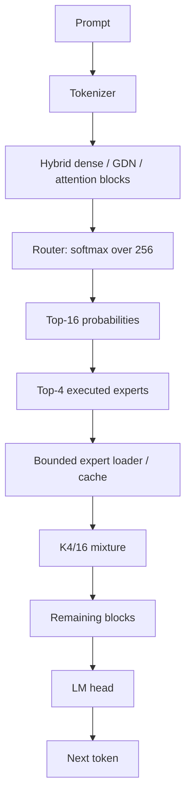

# Jamii Afya Architecture

How a 35B-parameter MoE runs inside a ~2.3 GB resident working set on a
commodity CPU with an ordinary SSD. Every number below is measured; every
table cites its source. Kaggle development measurements are never presented
as official target-hardware results (see §13).

## 1. Design Goal

- Core i5-class CPU, ~8 GB RAM, no discrete GPU, commodity SSD.
- Single-stream interactive inference (batch 1, CPU-only).
- Hard competition limit: <7 GB peak RSS (`RAM_LIMIT_GB = 7.0`).
- Demonstrated base RSS: **2301.2 MB** (bounded exact-IQP executor,
  `research/native_sparse_experiments/results/phase6g_bounded_executor_v5`,
  peak_rss_mib 2301.23 on Qwen3.5/K8/IQ2_XXS, 826 slots — provenance §7).
- Use case: offline bilingual (English/Kiswahili) clinical decision support
  for community health workers.

## 2. Core Insight

The model is large in total parameters but activates a small subset per
token. Fine-grained MoE (256 experts/layer, top-8 native) means <5% of
expert weights participate in any one token.

> Storage capacity holds the model.
> RAM holds the working set.
> CPU evaluates the active sparse path.

Concretely: the full routed-expert bank (~10 GB) lives on SSD; RAM holds
dense/shared tensors + runtime + a bounded expert staging area (~2.3 GB
demonstrated); the CPU evaluates only the 4 selected experts per layer
(§4) in 2-bit kernels (§5), fetched on demand through an explicit
byte-bounded executor (§6) that never lets residency grow with model size.

## 3. Base Model

Qwen3.6-35B-A3B (GGUF `Qwen3.6-35B-A3B-UD-IQ2_XXS`, unsloth,
commit `a483e9e`). All constants below are read off the artifact's own
tensor table (733 tensors; JOIN4b `transcode_q2k.log`):

| quantity | value | source |
|---|---|---|
| layers | 40 (30 GDN + 10 full attention) | blk.0–39; 30× fused `attn_qkv`, 10× split q/k/v/o |
| routed experts/layer | 256 | `ffn_*_exps` 3rd dim |
| native top-K | 8 | `PHASE3_5.md` (k=8 trained) |
| n_embd | 2048 | `attn_qkv [2048, 8192]`, `gate_exps [2048, 512, 256]` |
| expert ffn dim | 512 | gate/up `[2048, 512]`, down `[512, 2048]` per expert |
| router | 2048→256, f32 | `ffn_gate_inp [2048, 256]` |
| GDN state | 32-dim, conv-4 | `ssm_alpha/beta [2048, 32]`, `ssm_conv1d [4, 8192]` |
| shared expert/layer | gate/up q5_K, down q6_K | `ffn_*_shexp` |
| vocab | 248,320 | `token_embd [2048, 248320]` |
| total params | ≈34.8B ("35B") | 40×256×3.15M routed (32.2B) + ~1.6B dense + ~1.0B embd/LM |
| active/token, native K8 | ≈3.6B ("A3B") | dense ~2.6B + 8×3.15M×40 ≈ 1.0B expert |
| active/token, K4/16 | ≈3.1B | dense ~2.6B + 4×3.15M×40 ≈ 0.5B expert |

Hybrid structure: GDN layers carry fused `attn_qkv [2048, 8192]` plus a
`attn_gate [2048, 4096]` and `ssm_out [4096, 2048]`; the 10 full-attention
layers carry split q `[2048, 8192]` / k,v `[2048, 512]` (GQA) / output
`[4096, 2048]`. Attention projections dominate decode (§9).

## 4. K4/16

Native execution evaluates the top-8 experts per layer. We execute the
top-4 (k1=4, halving expert FLOPs and fetch bytes) but renormalize the
mixture over the top-16 router mass (k2=16), following Chen & Yao
(arXiv:2609.04575v1, Eq. 2 — formula verified against the paper,
`PHASE3_5.md`):

```text
p = softmax(W_g x) over all E=256 experts
w_i = p_i / SUM_{j in T_16} p_j,   for i in T_4    (T_4 ⊆ T_16)
y = SUM_{i in T_4} w_i E_i(x) + g_sh E_sh(x)
```

k2=16 does **not** mean 16 experts execute: only the 4 MLPs in T_4 run.
k2 only widens the renormalization denominator (weights sum to m_4/m_16
< 1, an adaptive sub-unity gain). The router already computes all 256
probabilities, so k2 costs ~nothing (a wider top-k; measured, §9 router
row). The shared expert is untouched (separate gate). No weights change.

Measured ablation (MMLU-200 matched-likelihood, σ≈3.5pp; `PHASE3_5.md`):

| arm | k1 | k2 | score | Δ vs native | wall |
|---|---|---|---|---|---|
| native (unset) | – | – | 42.0 | – | 2112s |
| k8exp (patched control) | 8 | 8 | 42.0 | 0.0 (exact) | 2136s |
| naive k4 | 4 | 4 | 38.5 | −3.5pp | 1677s |
| k48 | 4 | 8 | 40.0 | −2.0pp | 1743s |
| k412 | 4 | 12 | 41.5 | −0.5pp | 1774s |
| **k416 (LOCKED)** | 4 | 16 | 41.0 | **−1.0pp** | 1672s |
| k424 | 4 | 24 | 39.5 | −2.5pp | 1717s |
| k432 | 4 | 32 | 40.0 | −2.0pp | 1733s |

Naive K4 degrades quality (−3.5pp); K4/16 repairs most of it (−1.0pp,
within noise) at full K4 speed (1.26× MMLU wall). k2=16 locked (paper's
choice; flat within noise for k2∈8..32; k2 changes only the
renormalization scalar, never the executed set, so speed/traces/cache are
k2-independent). Implementation: env-gated patch on the llama.cpp pin
(`GGML_MOE_K1/K2`, default native; k2==k1 keeps native norm lines verbatim
for control bit-parity).

## 5. Mixed Quantization

Routed experts → **Q2_K** (2-bit K-quant, tiled kernels). Everything else
keeps higher-quality types (see `configs/final_runtime.json`):

- attention q/k/v/o/gate: q5_K · shared gate/up: q5_K, down: q6_K
- LM head + token embeddings: q4_K · ssm_out: q6_K
- norms, router, SSM params: f32
- Final artifact: 11694.3 MiB, 2.83 BPW (from 10258.3 MiB IQ2 source).

Quality gates (matched MMLU, transcoded worst-case IQ2→Q2_K, `PHASE1_REPORT.md` §9):

| arm | MMLU-100 | Δ | verdict |
|---|---|---|---|
| control (IQ2) | 37.0% ±4.9 | – | – |
| **q2k-experts** | 39.0% ±4.9 | +2.0pp (noise) | **KEEP — quality-proven** |
| q2k-all | 26.0% ±4.4 | −11.0pp | **REJECT** |

Q2_K everywhere destroys quality (head/embeddings/dense must not go to
2-bit); Q2_K on routed experts alone shows no measurable regression even
in the worst case (production from-bf16 is strictly better). Joint gate
(Q2K-experts + K4/16): MMLU-200 **38.5%** vs native 42.0 (−3.5pp, within
noise of both parents; no Q2K×K4 interaction demonstrated).

## 6. Bounded Sparse Executor

The centerpiece. Routed experts never become resident wholesale: each
(layer, expert) request is served from an explicit bounded slot store
backed by `pread()` from the GGUF, so peak RSS is a deterministic
function of (slots × bundle bytes) plus the dense floor — never of model
size. Outputs are bit-identical to resident execution at every cache size
(asserted per run: staged fetch is exact).

```text
router ──► top-4 expert IDs ──► (layer, expert) key ──► resident slot?
                                                              ┌────┴────┐
                                                             yes        no
                                                              │          │
                                                           compute    pread() ──► bounded slot ──► compute
```

Mechanics (`probes/edge0_port/join4_phase6.h`, applied by
`probes/edge0_port/join4_apply.py` onto llama.cpp pin `3057bb6`):

- The loader marks routed `ffn_*_exps` tensors `TENSOR_READ_LAZY` and
  registers (fd, base_offset, expert_stride) with the executor.
- `MUL_MAT_ID` compute redirects per-expert source pointers into slots;
  misses `pread()` the gate/up/down planes (async worker threads overlap
  fetch with the previous layer's compute; pinned bundles preload at t=0).
- Eviction is plain slot reuse (no `madvise`, refill overwrites in place —
  ~15× cheaper per miss, exact output). A zero-copy `mmap`+`madvise`
  challenger was built and **killed**: fault-around zombie PTEs re-mapped
  evicted pages and RSS climbed unboundedly (phase10i verdict; code kept
  in-tree, never enabled).
- Dense/shared tensors stay ordinarily resident (the dense floor, §7).

Correctness is cache-size independent: the same bytes compute regardless
of hit/miss; every benchmark run asserts output-hash and route-trace
equality against the resident arm.

## 7. Memory Architecture

```text
RAM (≈2.3 GB demonstrated)
├─ dense/shared model tensors (mmap page cache, always touched)
├─ runtime buffers + KV/context (ctx 512)
└─ bounded expert staging (slots × bundle; 826 slots @2.3GB point)

SSD
└─ full routed expert bank (10.1 GB Q2_K; paged per miss)
```

| configuration | peak RSS | source |
|---|---|---|
| demonstrated base (bounded exact-IQP, 826 slots) | **2301.2 MB** | phase6g v5, Qwen3.5/K8/IQ2, temp 0, n=64 |
| frozen b3 (755 slots, 80 pinL2) | 2.37 GB | JOIN4 v2, Qwen3.6/K4/16/Q2K |
| frozen b4 / b5 / b6 | 3.33 / 4.28 / 5.23 GB | JOIN4 v2 |
| full resident reference | ~12 GB (12071 MiB) | JOIN4b v2 (539 MiB anon + file) |

The model stays functional below 3 GB because only the *working set* is
resident: dense floor (~1.2 GB anon + page cache) plus a fixed staging
budget. Extra RAM only buys hit rate (optional larger slot counts), never
correctness — and §8's finding is that extra RAM bought far less
end-to-end speed than expected once compute dominated.

Provenance honesty: 2301.2 MB was demonstrated on the Qwen3.5/K8/IQ2
vehicle; the frozen Qwen3.6/K4/16/Q2K b3 point measures 2.37 GB on the
same methodology. Both are development (Kaggle) numbers, never official
target-hardware claims (§13).

## 8. Expert Cache

Slot contents are managed by static pins plus dynamic LRU with hybrid
policy per budget (`cache_config_k4.json`, transfer-validated):

| budget | slots | pins | policy | sim hit |
|---|---|---|---|---|
| 3 GB | 755 | 80 | pinL2 | 0.557 |
| 4 GB | 1724 | 80 | pinL2 | 0.753 |
| 5 GB | 2693 | 1346 | hyb50 | 0.859 |
| 6 GB | 3662 | 915 | hyb25 | 0.933 |

Measured b6: hit 0.966, 16.5 miss/tok, 17.1 MB/tok (JOIN4b v2 — sits
between cold-per-prompt and warm-continuous sims, as predicted).

Atomic K-event semantics: all four experts of a layer are classified
against the *same pre-event cache state*, then admissions/evictions apply
(`probes/edge0_port/cache_atomic.py`, regression-tested). Sequential
replay (classify-admit-classify-admit…) was **wrong**: it let later
experts in the same layer observe admissions from earlier ones, inflating
simulated hits. Found by test, fixed by construction.

Final finding: across 3→6 GB the end-to-end gain was modest (b3 5.26 →
b6 4.95 t/s warm on the 23-prompt mix; long sessions favor b6 via
10.8 vs 22.6 warm miss/tok). Once staging was bounded and overlapped,
dense CPU matmul — not fetch — set the pace (§9).

## 9. CPU Decode Pipeline

Repaired weight-bucket profile, resident decode, frozen config
(JOIN4b v2; every matmul attributed by loader weight name; `other` = 0.0):

| bucket | ms/tok | share |
|---|---|---|
| attention projections (Q/K/V/O + gate) | 46.5 | 31% |
| routed experts (40×4 Q2_K MLPs) | 18.2 | 12% |
| LM head | 15.1 | 10% |
| GDN (SSM) | 12.3 | 8% |
| shared experts | 7.7 | 5% |
| router (gate GEMV + top-k) | 4.2 | 3% |
| non-matmul (norms, activations, elementwise) | ~44 | 29% |
| **total** | **150.9 (6.63 t/s)** | |

Bounded b6 (205.9 ms/tok): fetch adds 16.5 ms labeled plus ~20 ms of
async ready-wait inside expert-node wall; all buckets inflate ~10% from
prefetch contention. TTFT: 2.7s resident / 5.2s b6.

The engineering story in one paragraph: initially the hard problem was
memory capacity and expert I/O (12 GB resident vs 7 GB limit). After
sparsity + bounded staging solved capacity, the bottleneck shifted to
dense CPU matmul — especially the 10 full-attention layers' Q5_K
projections, the single largest bucket at 31%, larger than all routed
expert compute combined. A follow-up scheduler-flag probe was scoped and
then cancelled (bounded above at ~0–2%: sleep/wake is microseconds per
graph against a 150 ms budget); attention requant was deferred on
quality-risk grounds. Those are the two measured next buckets, in order.

## 10. Quality Preservation

Full ablation path (matched-likelihood MMLU; absolute scores differ from
5-shot prompting — the test is the delta pattern):

| step | MMLU | Δ vs native | source |
|---|---|---|---|
| native K8 | 42.0 (n=200) | – | PHASE3_5 |
| naive K4 | 38.5 | −3.5pp | PHASE3_5 |
| corrected K4/16 | 41.0 | −1.0pp | PHASE3_5 (LOCKED) |
| Q2K-experts (K8) | 39.0 vs 37.0 ctrl (n=100) | +2.0pp (noise) | PHASE1 §9 |
| joint Q2K + K4/16 | 38.5 (n=200) | −3.5pp (in noise) | PHASE3_5 r-v2 |

External corroboration: Chen & Yao report (4,16) −0.35pp (p=0.66,
indistinguishable) on MMLU-2000 5-shot. Functional sanity: 23-prompt
EN/SW/instruction mix runs bit-exact across all arms and cache sizes
(JOIN4 sha-gate); dedicated English/medical/Kiswahili/safety generation
checks are part of the final reproduction test (§14).

Rejected ideas (documented so the survivors are credible):

| idea | verdict | why |
|---|---|---|
| Q2_K all-model | REJECT (measured) | −11.0pp MMLU; head/embeddings/dense must not go 2-bit |
| Q3_K experts | KILLED | Pareto-dominated: slower than Q2_K *and* bigger |
| dense-Q2K (attn/shared) | not adopted | narrower than q2k-all but never passed its own gate |
| learned prerouter | not adopted | probed (`edge0prerouter`); frozen system is training-free |
| Recover-LoRA | not needed | paper's mandatory follow-up moot at −1.0pp |
| MTP speculative decoding | never built | gap-closer speculation only; no draft infrastructure |
| dynamic/layer skipping | not pursued | no evidence either way; sprint ended first |
| width/neuron sparsity | not pursued | same |
| expert factorization/basis | KILL on proxy | 8.9% median error vs 5% bar (atom probe) |
| zero-copy remap | built, KILLED | fault-around PTEs re-mapped evicted pages; RSS unbounded |
| Least-Stale policy | not pursued | LRU/hybrid validated; no time for policy search |
| tiled K-quant PR #27851 | not a decode win | published tg64 parity 2.90=2.90 despite PP gains |
| full task-DAG port | not ported | minimal mechanism (never-sleep) bounded by poll flags |

## 11. End-to-End Token Flow



## 12. Why Commodity Hardware Works

Conventional residency loads the whole model into RAM (12 GB → fails on
8 GB machines). Sparse working-set execution instead faults only the
active path: dense floor + 4 experts × 40 layers per token, staged
through a fixed budget. The 35B parameters are *addressable* from SSD;
the ~3B active parameters are *computable* from RAM. Throughput then
follows CPU matmul roofline, not model size — which is why a Core i5
with a commodity SSD sustains 5+ tok/s (dev) on a model 5× its RAM.

## 13. Benchmark Methodology

Two measurement regimes, never merged:

- **Development (Kaggle, 4 vCPU):** all §7/§9 numbers. Vehicle for
  ablations, gates, and profiles. Labeled "dev" everywhere.
- **Official (Core i5 target / adtc-profiler):** `benchmarks/final/`
  holds the harness, raw `result.json`, and the human report. The
  profiler's throughput/memory stages run our *patched* `llama-bench`
  (K1K2 + bounded executor are env-gated; env documented in
  `configs/final_runtime.json` and `docs/profiler.md`).

Known integration risk (stated plainly): the profiler's *accuracy*
stage scores continuations in-process via **stock** llama-cpp-python
(native K8, full mmap). That backend cannot express K4/16 and would
fault the full 12 GB on an 8 GB audit box. Throughput/memory are
measured on the true frozen system; accuracy-as-shipped would measure a
different (K8, possibly OOM) configuration. This needs organizer
confirmation; see `docs/profiler.md`.

RSS reporting rule: development base 2301.2 MB and official profiler
peak RSS are reported side by side, never overwritten, never conflated.

## 14. Reproducibility

Authoritative values live in `configs/final_runtime.json`:

- source commit `ae00494e`, llama.cpp pin `3057bb6c`
- build: `cmake -DCMAKE_BUILD_TYPE=Release -DGGML_NATIVE=ON`,
  targets `llama-cli llama-server llama-bench`
- model `Qwen3.6-35B-A3B-UD-Q2K-experts.gguf`, 12262341600 bytes,
  sha256 `0f3698ae…c7603b` (HF URL in the config file)
- K1=4, K2=16, threads=4, poll=0, ctx 512, temp 0.7, top-p 0.9
- b3: 755 slots + 80 pinL2 pins (`cache_config_k4.json`)
- benchmark: profiler command in `docs/profiler.md`; seeds `1000+pid`;
  raw JSON in `benchmarks/final/result.json`

## 15. Limitations

- SSD latency matters in bounded mode (16.5 ms/tok fetch at b6; slower
  disks shift the 3 GB point down — disk sensitivity was modeled, §8).
- Dense CPU matmul is the current bottleneck (attention 31%); faster
  CPU helps linearly, more RAM does not.
- Long context grows KV memory outside the expert budget (ctx 512
  validated; 2k+ needs re-measurement).
- K4/16 is approximate (−1.0pp MMLU-200; paper: indistinguishable).
- Thinking output is streamed separately by the sparse backend and displayed
  in the UI. The pinned runtime caps only the internal thinking block by
  default (512 tokens), then continues with the visible answer; set
  `ADTC_REASONING_BUDGET=-1` for unrestricted thinking. There is no second
  answer request.
- No clinician review anywhere in the model or reference corpus; clinical
  answers remain decision support and require qualified review.
- Throughput varies with host CPU/disk; Kaggle ≠ Core i5 (see §13).
- Profiler accuracy-stage integration unresolved (see §13).

## 16. Application response path

The interactive application deliberately has no classification or response
policy layer between the user and the model:

```
user question + conversation history
        ↓
versioned system prompt
        ↓
BM25 retrieval and compression when the offline corpus has a strong match
        ↓
pinned Qwen3.6 runtime
        ↓
model response and model-emitted thinking streamed to the UI
```

The system prompt asks for detailed explanations, calibrated uncertainty, and
medication information only when explicitly requested. The application does
not attach urgency labels, inject structured cards, lint or rewrite output,
regenerate an answer, or substitute a fixed fallback. The UI shows the model
response, optional RAG sources, and runtime telemetry.

## 18. Rejected Product Directions & Historical Map

Runtime-level rejects live in §10. Product-level:

| direction | verdict | why |
|---|---|---|
| Falcon-H1 1.5B full fine-tune line | SUPERSEDED | complete LoRA/SFT trajectory built and profiled, but clinically weaker than the sparse 35B at comparable laptop RAM |
| Small dense models (0.6B–4B) | SUPERSEDED | same reason: capability per gigabyte favors sparse MoE |
| Weight-level Qwen fine-tuning | NO-GO | prepared pipeline; 2×T4 cannot load 35B/rank (TRAINING.md) |
| Cloud/proprietary APIs | never considered | offline-first requirement |

Superseded Falcon-era files are retained as research records with green
tests — NOT production paths: `scripts/*falcon*`, `tests/test_falcon*`,
`configs/falcon-*`, `kaggle/phase04-falcon-*`, `docs/research/falcon*`,
`eval/falcon_final_48q.json`, `requirements-falcon-production.txt`.
Production code, configs, metadata, docs, and UI contain zero Falcon
references. External prior-art comparison (AirLLM, Fiddler, FlashMoE,
HotPin, TokenQL, SwapMoE, llama.cpp offload work, and more) with
explicit claimed/non-claimed novelty: NOVELTY.md.
