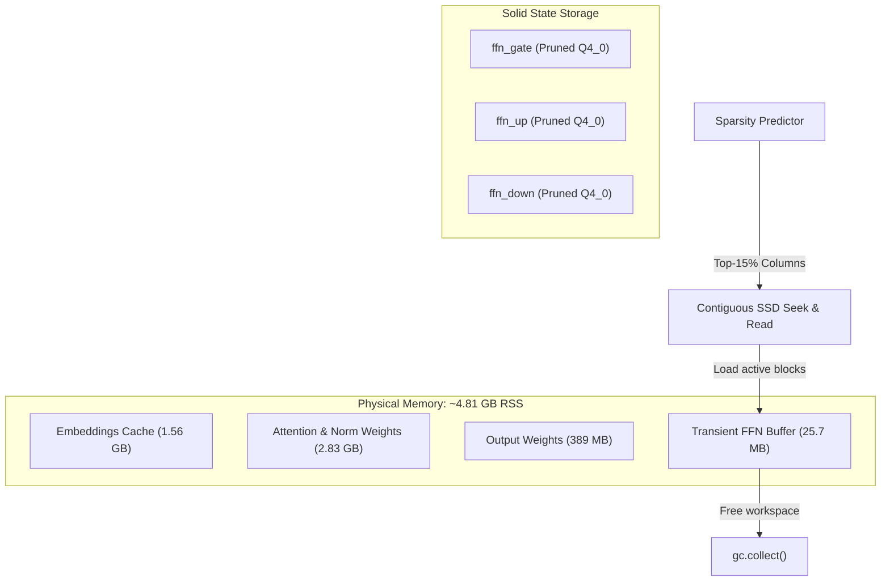

# Custom Page-Swapped Serving Engine for Limited-Memory CPU Architecture

This serving engine is a custom, hardware-constrained Transformer inference runtime designed to run large-scale language models (specifically **Qwen 2.5 14B Instruct Q4_0**) under a strict **5.5 GB Resident Set Size (RSS)** ceiling. The engine operates entirely offline on consumer CPU architectures (e.g., Intel Core i5 profiles) without discrete GPU acceleration, relying on platform-optimized memory management and low-level JIT execution.

---

## 1. Memory Budget and System Architecture

Serving a 14B parameter model in standard FP16 or even unified Q4_0 quantization typically requires loading the full weights into RAM (approx. 9.0 GB), causing instant Out-Of-Memory (OOM) faults on a 5.5 GB memory limit. The system bypasses this by implementing a **Hybrid Attention-in-RAM + Sparse FFN SSD Streaming** architecture.

### Memory Allocation Matrix (Qwen 2.5 14B Target)

*   **Permanent RAM Allocations:**
    *   **Embeddings (`token_embd.weight`):** Transposed and loaded in native FP16 format $\approx 1.56 \text{ GB}$.
    *   **Output Projection (`output.weight`):** Loaded in Q4_0 format $\approx 389 \text{ MB}$.
    *   **Self-Attention & Norms (48 layers):** Permanently cached in RAM in Q4_0 format $\approx 2.83 \text{ GB}$.
*   **Transient RAM Allocation:**
    *   **FFN Streaming Workspaces:** Shared, single-layer NumPy pre-allocated buffers used for active FFN calculations and immediately released $\approx 25.7 \text{ MB}$.
*   **Total Serving RAM Footprint:** $\approx 4.81 \text{ GB}$ (leaving $\approx 690 \text{ MB}$ for OS overhead and the Python runtime).



---

## 2. Quantization and Static Dimension Pruning (`src/pruning.py`)

To minimize the sequential disk I/O payload during generation, the model undergoes static pruning before serving:

1.  **Dequantization:** The block-quantized Q4_0 weights of the Feed-Forward Network (FFN) layers (Gate, Up, and Down projections) are dequantized to float32.
2.  **Dimension Contraction:** The intermediate dimension ($D_{ffn} = 13,696$) is pruned by 50% ($D_{pruned} = 6,848$) along the activation routing axes to remove low-variance features.
3.  **Re-Quantization:** The contracted matrices are re-packed into GGML-compliant Q4_0 blocks (18-byte blocks containing a 2-byte float16 scale and 16 bytes of packed 4-bit nibbles).

---

## 3. Dynamic Column Sparsity Prediction and SSD Paging

During the forward pass of token decoding, the FFN layers are processed using a dynamic row-slicing method:

*   **Top-K Sparsity Predictor (`src/memory_manager.py`):** Maps the current hidden state $x \in \mathbb{R}^{D_{model}}$ to predicted intermediate indices using a static projection routing matrix:
    $$S = \text{argmax}(W_{proj} x)$$
*   **Active Row Streaming:** Slices and loads only the top 15% predicted active rows ($\approx 1,027$ out of $6,848$ rows) for the `ffn_gate` and `ffn_up` weights.
*   **Contiguous Disk Reads:** Instead of performing expensive random seeks across the GGUF file pointer, the engine performs a single sequential file read of the target layer offset and extracts the active indices in memory.
*   **Deterministic Memory Reclamation:** The transient workspace buffer is immediately dereferenced and garbage collected (`gc.collect()`) upon completing the layer forward step.

---

## 4. JIT-Compiled Math Kernels (`src/attention.py`)

All core arithmetic calculations are compiled at startup using **Numba JIT** (`@njit(fastmath=True, parallel=True)`) to execute directly on the packed byte representation of Q4_0 weights, avoiding intermediate matrix copies:

*   **Nibble Unpacking Formula:**
    $$q_{low} = (B_{val} \ \& \ 15) - 8.0$$
    $$q_{high} = (B_{val} \gg 4) - 8.0$$
*   **Index Mapping Alignment:**
    $$\text{Weight}[b \cdot 32 + j] = q_{low} \cdot \text{scale}$$
    $$\text{Weight}[b \cdot 32 + j + 16] = q_{high} \cdot \text{scale}$$
    where $b$ is the block index, and $j$ ranges from $0$ to $15$.

---

## 5. TurboQuant Low-Bit KV Cache (`src/turboquant_numpy.py`)

The Key-Value (KV) cache uses a Lloyd-Max optimal scalar quantizer derived from coordinate PDFs over a Haar-rotated unit sphere:

*   **Key Cache:** Quantized to 4-bit indices using a projected sign-residual correction method (Quantized Johnson-Lindenstrauss stage) to maintain dot-product resolution.
*   **Value Cache:** Quantized to 2-bit/8-bit MSE-optimal representations using Lloyd-Max centroid codebooks.
*   **Bit-Packing:** Custom bit-packing arrays pack 4-bit and 2-bit coordinate indices into flat `uint8` byte vectors to reduce cache memory footprint by up to 60%.

---

## 6. Standalone Retrieval-Augmented Generation (RAG) Modules

For context-augmented diagnostic queries, the repository includes two standalone utility classes that operate with zero persistent memory overhead:

*   **BM25 Retriever (`src/db_retriever.py`):** Pure NumPy search index that fits BM25 document metrics and retrieves matching clinical document slices.
*   **Context Compressor (`src/context_compressor.py`):** A Jaccard-overlap text compressor that scores sentences relative to input queries and rebuilds a dense prompt (max 400 words) to reduce prompt prefill latency.

---

## 7. Execution and Verification Pipeline

Developers can prune, benchmark, and run the pipeline using the following command sequence:

### 1. Clean the Model Workspace
```bash
rm -f model/Qwen2.5-14B-Instruct-Q4_0.gguf model/Qwen2.5-14B-Instruct-Q4_0-Pruned.gguf
```

### 2. Execute the Resumable GGUF Downloader
```bash
./download_model.sh
```

### 3. Run the Static FFN Pruner (50% contraction)
```bash
PYTHONPATH=. ./venv/bin/python src/pruning.py model/Qwen2.5-14B-Instruct-Q4_0.gguf model/Qwen2.5-14B-Instruct-Q4_0-Pruned.gguf 0.5
```

### 4. Set Active Model Target
```bash
mv model/Qwen2.5-14B-Instruct-Q4_0.gguf model/Qwen2.5-14B-Instruct-Q4_0-Original.gguf
cp model/Qwen2.5-14B-Instruct-Q4_0-Pruned.gguf model/Qwen2.5-14B-Instruct-Q4_0.gguf
```

### 5. Run the Standardized Benchmark Suite
Profiles RSS/VMS allocations and latency percentiles (P50/P90/P95) across short (16 tokens), medium (128 tokens), and long (512 tokens) contexts:
```bash
PYTHONPATH=. ./venv/bin/python src/benchmark.py
```
*Saves results to [benchmark_report.md](file:///Users/toheeb.ogunade/Workspace/adtc-llm-limited-hardware/benchmark_report.md) & [data/benchmark_telemetry.csv](file:///Users/toheeb.ogunade/Workspace/adtc-llm-limited-hardware/data/benchmark_telemetry.csv)*

### 6. Run Clinical Inference & Swahili Evaluation
Executes symptom QA cases and scores responses using matching keywords:
```bash
PYTHONPATH=. ./venv/bin/python src/main.py
```

---

## 8. Numba JIT Compilation and Type Constraints

*   **Float16 CPU Limitations:** Since CPU architectures do not natively support FP16 arithmetic inside Numba JIT loops, the GGUF loader converts scale values to `float32` immediately upon reading them from block arrays.
*   **Static Type Signatures:** Numba cannot compile standard Python instance methods using `self` context parameters. Arithmetic logic is isolated into standalone `@njit` functions (e.g. `inner_product_jit`, `rms_norm_jit`, `gemv_q4_0`) with explicit NumPy arrays as parameters.